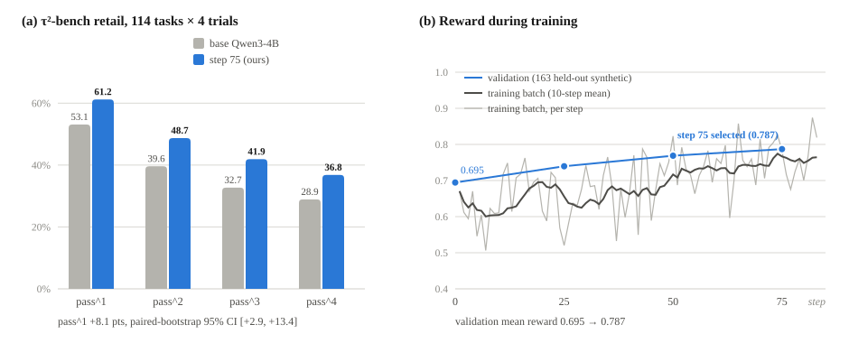
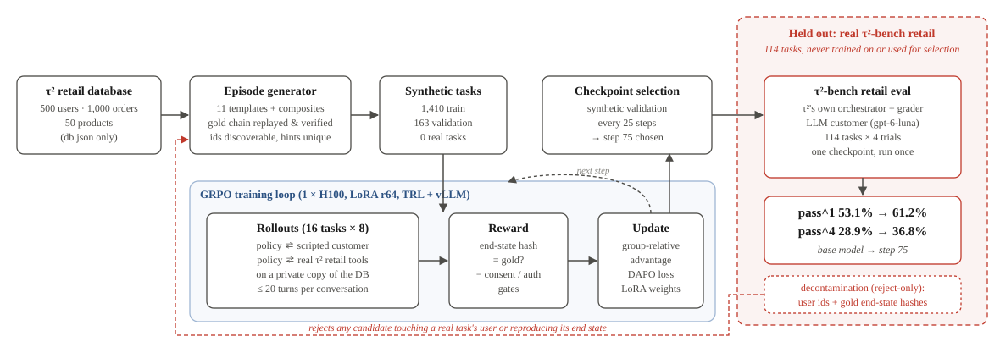
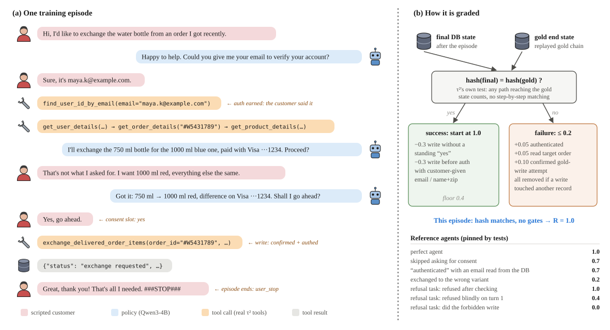
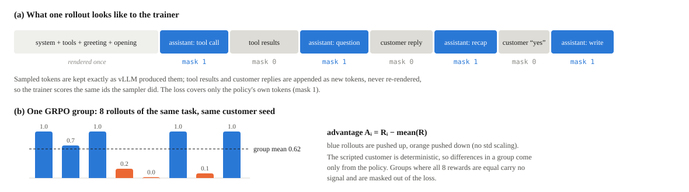

# tau-forge

RL fine-tuning of **Qwen3-4B-Instruct-2507** for multi-turn customer-service tool use, trained
**only on synthetic conversations** and evaluated on the real
[τ²-bench](https://github.com/sierra-research/tau2-bench) retail benchmark.

## Result

One LoRA GRPO checkpoint (step 75), evaluated once on all 114 real τ²-bench retail tasks with
4 trials each, against the untrained base model under identical settings:

| Metric | Base model | Step 75 | Change |
|---|---|---|---|
| **pass^1** | 53.1% | **61.2%** | **+8.1** |
| pass^2 | 39.6% | 48.7% | +9.1 |
| pass^3 | 32.7% | 41.9% | +9.2 |
| **pass^4** | 28.9% | **36.8%** | **+7.9** |
| Successful conversations | 242 / 456 | 279 / 456 | +37 |
| Tasks solved at least once | 87 / 114 | 95 / 114 | +8 |

<p align="center"></p>

<p align="center"><sub><b>Figure 1.</b> (a) pass^k on τ²-bench retail, base vs step 75. (b) Change in successful trials per task:
40 tasks improved, 18 got worse. (c) Reward during training; blue points are the synthetic validation set used to
pick step 75.</sub></p>

pass^k is the probability that all k independent trials of a task succeed (τ²'s reliability
metric), averaged over tasks.

**Significance.** These tests compare the two runs on the same 114 tasks:

- **pass^1:** +8.1 points, paired-bootstrap 95% CI **[+2.9, +13.4]**, p ≈ 0.001.
- **pass^4:** +7.9 points, CI **[+0.9, +14.9]**.
- **Per task:** 40 tasks gained successes and 18 lost some (sign test p ≈ 0.005).
- **Never solved → solved:** 12 tasks the base model never solved are now solved at least once.

**What was held fixed.** Both runs used the same:

- user simulator: `gpt-6-luna`, temperature 1.0;
- user guidelines;
- agent settings: temperature 0, seed 300, 4 trials, 200 max steps;
- task ids.

All 456 conversations in each run ended normally, with no infrastructure errors.

**Caveat.** These numbers use a non-standard user simulator, so they are comparable to each
other, not to published leaderboard or model-card numbers (see [Evaluation setup](#evaluation-setup)).

## Held-out policy

**None of the 114 real τ²-bench retail tasks were used for training, data generation, or
checkpoint selection.** That covers the full train + test split, not just test.

- **Generator isolation:** the task file is read by one module, `tau_forge/decontam/real_tasks.py`.
  It reduces the tasks to two opaque reject sets: the user ids their gold actions touch, and
  their gold end-state hashes. The episode generator only uses these to *reject* candidates.
  No task text ever enters generation.
- **Checkpoint selection:** chosen on a synthetic validation set (163 tasks).
- **Single eval:** τ² was run on exactly one trained checkpoint.

## Pipeline

<p align="center"></p>

<p align="center"><sub><b>Figure 2.</b> Pipeline. Everything left of the red boundary sees only the retail database and
synthetic tasks. The real benchmark is used once, for the final eval; its tasks only reach the generator as a
reject-only filter.</sub></p>

### 1. Synthetic episodes (`tau_forge/episodes/`)

Each task is a whole conversation sampled from τ²'s retail database (500 users, 1,000 orders,
50 products). It is never derived from the benchmark's tasks.

- **Templates:**
  - cancel, exchange, modify items, modify order address / payment, and modify user address;
  - returns where the customer first asks for a forbidden refund method;
  - refusals: someone else's order, or a cancel / return the order status doesn't allow;
  - information questions;
  - **composite** tasks chaining 2–3 requests in one conversation (36% of the mix).
- **Built-in difficulty knobs:**
  - authentication by email vs name+zip;
  - order id given directly vs "the one I got recently";
  - late corrections ("wrong one, I meant…");
  - variant and payment resolution.
- **Verification:** every task's gold tool chain is replayed against the real τ² tools. The
  generator also checks that every id the agent needs is discoverable from the conversation,
  and that every hint is unambiguous.
- **Scripted user:** a deterministic simulator (`user.py` + rule-based NLU in `nlu.py`).
  - It answers information requests.
  - It gives consent only to a correct, specific proposal.
  - It corrects wrong details.
  - It gives up on loops.

  This makes rollouts cheap and reproducible: no LLM is in the training loop.

### 2. Reward (`tau_forge/episodes/reward.py`)

<p align="center"></p>

<p align="center"><sub><b>Figure 3.</b> (a) A training episode: the policy authenticates, reads the order, proposes an
exchange, is corrected by the scripted customer, and writes only after an explicit yes. (b) Grading compares the final
database with the gold end state, then applies the consent and authentication gates.</sub></p>

The core signal is τ²'s own: **1 if the final database state hashes equal to the gold end state**.

**Penalties on a correct end state:**
- −0.3 for writing without a standing customer "yes";
- −0.3 for writing before authenticating the customer with details the *customer* provided.

**Failure shaping (capped at 0.2):**
- +0.1 for attempting the gold write, only if it was confirmed and made by the authenticated customer;
- withdrawn entirely if any write touched another record.

**Refusal tasks:**
- 1.0 for an unchanged database plus a denial made after authenticating and reading the order;
- 0.4 for an unchecked denial;
- 0.3 for a transfer to a human.

The intended ordering of these scores is pinned by scripted reference agents in `tests/`.

### 3. Training (`tau_forge/train/grpo_episodes.py`)

| Setting | Value |
|---|---|
| Base model | Qwen/Qwen3-4B-Instruct-2507 |
| Method | GRPO (DAPO loss, ε 0.2 / 0.28, β 0, no reward std-scaling), TRL + vLLM colocate |
| Adapter | LoRA r = 64, lr 1e-5 |
| Batch | 16 tasks × 8 rollouts = 128 full conversations per step |
| Sampling | temperature 1.0, ≤ 512 tokens/turn, ≤ 20 turns, 16k context |
| Groups with identical rewards | masked (no gradient) |
| Hardware | 1 × H100 80 GB, ~8.5 min/step |
| Run | stopped at step 83 (~11 h); **checkpoint 75 selected** by synthetic validation |

Multi-turn rollouts generate every assistant turn with the policy. Tool results and user turns
are appended with a loss mask of 0, and prompts are built with τ²'s real system prompt and tool
schemas, so training and eval see the same format.

<p align="center"></p>

<p align="center"><sub><b>Figure 4.</b> (a) A rollout as the trainer sees it: sampled tokens are kept verbatim and trained
on; environment tokens are appended with mask 0. (b) Rewards within one group of 8 rollouts and the resulting
advantages.</sub></p>

Synthetic validation (163 held-out synthetic tasks):

| Template | Step 0 | Step 75 |
|---|---|---|
| **Overall mean reward** | **0.695** | **0.787** |
| Overall success rate | 71.8% | 83.4% |
| composite (n=57) | 0.566 | 0.684 |
| exchange (n=21) | 0.729 | 1.000 |
| modify_items (n=17) | 0.718 | 0.782 |
| return_fallback (n=10) | 0.640 | 0.700 |
| status_refusal (n=11) | 0.918 | 1.000 |
| foreign_order_refusal (n=10) | 0.360 | 0.300 |

Logs: `runs/ep-main/` (`metrics.jsonl`, `val_log.jsonl`, `train.log`).

### 4. Evaluation setup

`tau_forge/eval/run_tau2.py` runs τ²-bench's own orchestrator and evaluator against the policy,
served by vLLM (hermes tool-call parser). Prompt parity with τ² is asserted.

- **User simulator:** `gpt-6-luna` at temperature 1.0 (it does not accept 0), with the default
  reasoning setting.
- **`--user-stop-rule`:** adds one sentence to τ²'s user guidelines so the simulated customer
  cannot confirm an action and end the conversation in the same message.
  - Without it, Luna did this in 58 of 456 base-model conversations, scoring the agent on
    actions it never got to take.
  - With it, this happened 0 times in either run.
- **Agent:** temperature 0, seed 300, 4 trials per task, 200 max steps.

Published τ²-bench numbers use a different user simulator, so absolute scores here are not
comparable to the leaderboard or the model card. The comparison that matters is base vs trained
under the same harness.

Raw results:
- `data/simulations/tau_forge_baseline-luna-stoprule_retail_base.{json,summary.json}`
- `data/simulations/tau_forge_step75-luna-stoprule_retail_base.{json,summary.json}`

## Reproduce

```bash
uv sync --extra train            # GPU box; vllm<=0.27.1, peft
git submodule update --init      # third_party/tau2-bench

# Train (synthetic pool in data/episodes/pool_v2/)
python -m tau_forge.train.grpo_episodes --help

# Merge the selected LoRA checkpoint and serve it
python scripts/merge_lora.py --adapter runs/ep-main/checkpoint-75 --out <merged-dir>
vllm serve <merged-dir> --served-model-name tau-forge-policy \
    --enable-auto-tool-choice --tool-call-parser hermes \
    --max-model-len 16384 --port 8000

# Real τ²-bench retail eval
export OPENAI_API_KEY=...
python -m tau_forge.eval.run_tau2 --label <name> --user-llm gpt-6-luna \
    --user-temperature 1.0 --user-stop-rule --task-split-name base --num-trials 4
python scripts/summarize_tau2.py data/simulations/<run>.json
```

Full command-by-command runbook: `docs/runbook.md`. Run the base model through the same eval
first; it is the only valid point of comparison.

## Repository layout

| Path | Contents |
|---|---|
| `tau_forge/episodes/` | task generator, scripted user, NLU, episode runner, reward |
| `tau_forge/train/` | GRPO trainer for multi-turn episodes, prompt building, tool-call parsing |
| `tau_forge/eval/` | τ²-bench eval entrypoint and prompt-parity checks |
| `tau_forge/envs/` | `RetailEnv`, a thin wrapper over τ²'s own retail tools and database |
| `tau_forge/decontam/` | isolation from the 114 real tasks |
| `data/episodes/pool_v2/` | the training and validation task pool used for this run |
| `data/simulations/` | τ²-bench eval outputs |
| `runs/ep-main/` | training metrics and logs |
| `docs/` | design notes, the GPU runbook, and README figures (`python scripts/make_figures.py`) |
| `third_party/tau2-bench` | τ²-bench, pinned as a git submodule |

Earlier stages are documented in detail in the README on the `claude/keen-dirac-3pocui` branch:

- single-step synthetic scenarios and their validation pipeline;
- variance audits;
- design decisions.

## Limitations and next steps

**Limitations:**
- **Noise:** a single eval run per model at 4 trials. A repeat eval would tighten the intervals.
- **Regressions:** 5 tasks the base model always solved are no longer always solved.
- **Weak templates:** foreign-order refusal and user-address changes did not improve on
  synthetic validation.
- **Formatting drift:** 5 of 6,365 agent messages had tool-call text vLLM couldn't parse
  (0 in the base run).

**Natural next steps:**
- rejection-sampled SFT plus a second RL round from step 75;
- templates targeting the weak behaviours above.
